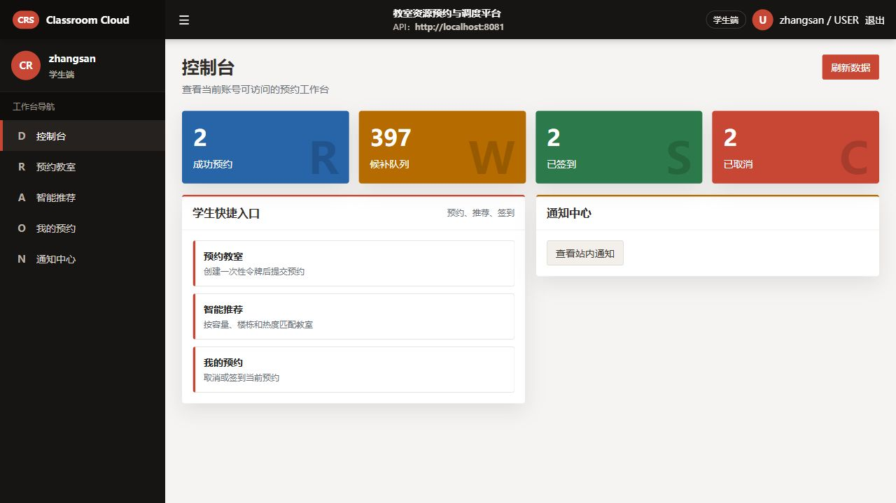
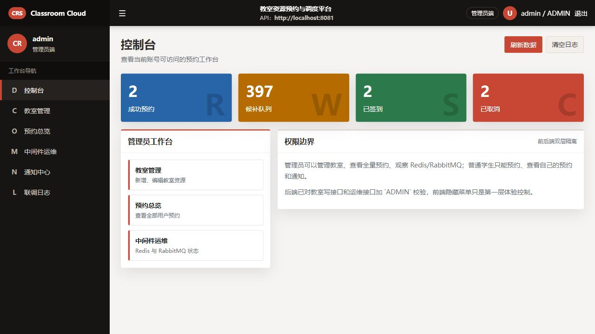
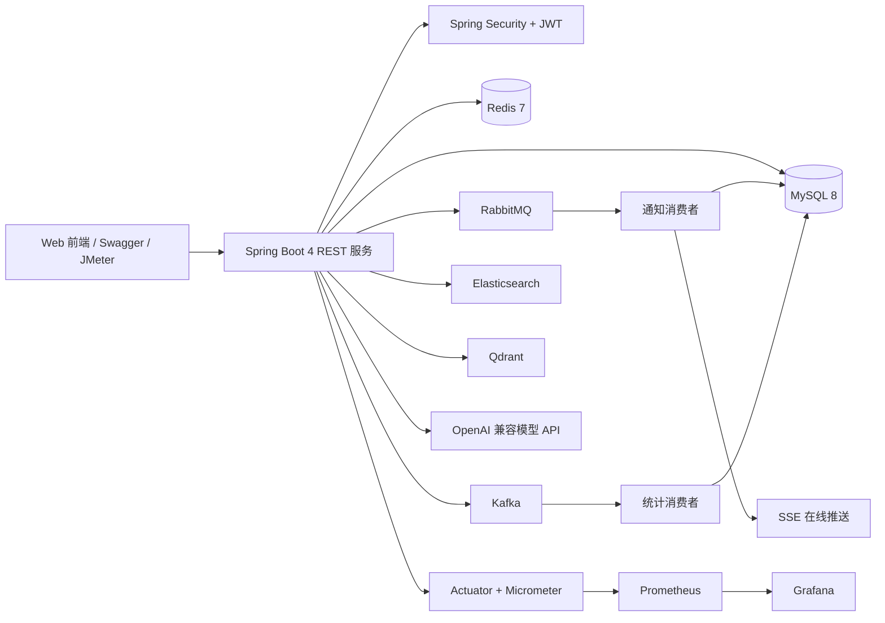
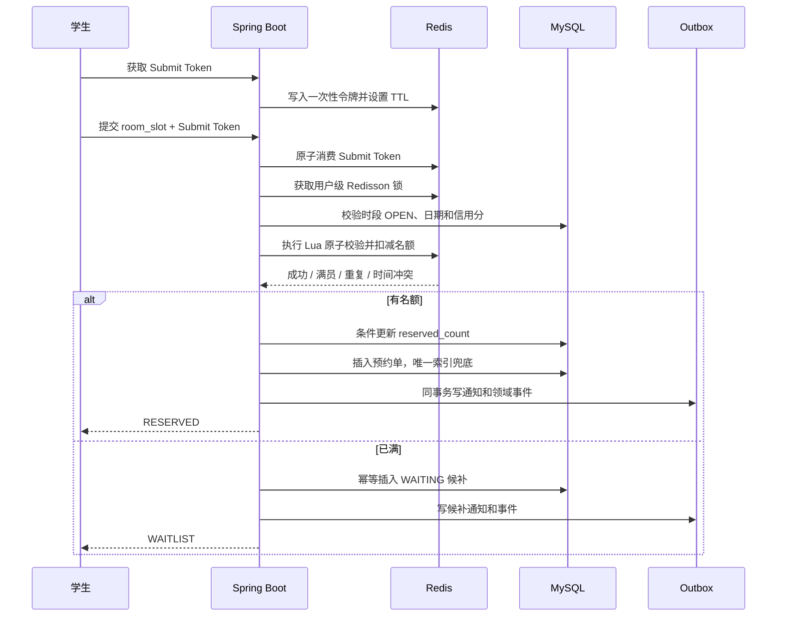

# 智慧校园教室预约与智能问答平台

基于 Spring Boot 4 的校园空间资源调度系统。项目以 `room_slot` 为核心资源模型，覆盖管理员开放教室时段、学生按名额预约、满员候补、签到与信用治理、异步通知、实时消息、统计分析，以及基于 LangChain4j + Qdrant 的预约助手和校规 RAG 问答。

> 当前版本重点完成学生与管理员主流程。教师整间教室申请已经预留 `tb_teacher_booking` 数据模型，但审批接口与前端流程仍属于后续扩展，不作为当前已交付功能宣传。

## 项目看点

- **业务模型合理**：学生预约的是一个开放教室时段中的一个名额，而不是占用整间教室；管理员统一决定哪些 `room_slot` 可以被预约。
- **并发链路可验证**：Submit Token、用户级 Redisson 锁、Redis Lua、MySQL 条件更新和唯一索引共同保证名额边界、重复预约和同时间段冲突。
- **候补与履约闭环**：满员自动候补，取消或爽约释放名额后按 FIFO 补位；签到窗口、未签到扫描和信用流水形成完整履约治理。
- **消息职责清晰**：RabbitMQ 负责业务通知，Kafka 负责已发生事件的统计分析，SSE 负责在线推送，Outbox 解决数据库与消息系统的最终一致性。
- **检索与事务分离**：Caffeine + Redis 服务热点查询，Elasticsearch 服务教室复杂检索；预约是否成功始终回到 Redis Lua 与 MySQL 事务判断。
- **Agent 具备工程边界**：LangChain4j 只向模型暴露只读工具，RAG 使用关键词和向量双路召回、RRF 融合及 Cross-Encoder 精排，并提供降级、调用追踪和离线评测。

## 页面预览

| 登录页 | 学生工作台 | 管理员工作台 |
| --- | --- | --- |
|  |  |  |

前端由 Spring Boot 静态资源直接提供，不需要单独启动 Node 服务。登录后按照 `ADMIN` 和 `USER` 角色展示不同菜单，登录页和注册页不显示业务侧边栏。

## 核心业务

### 为什么核心是 room_slot

`room_slot` 表示“某间教室 + 某个日期 + 某个时间段”的可调度资源。教室容量属于 `room`，但某一次是否开放、可以预约多少人、已经预约多少人以及当前状态都属于 `room_slot`。

这种建模让以下行为作用于同一个资源对象：

1. 管理员手动或批量创建可预约时段。
2. 学生预约时段中的一个名额，多名学生可以预约同一时段。
3. 时段满员后，学生进入与该时段绑定的候补队列。
4. 管理员关闭或维护时段时，后端检查是否已有有效预约。
5. 预约、取消、签到、爽约和候补事件都携带 `room_slot_id`，便于统计与审计。

### 角色与能力

| 角色 | 当前能力 |
| --- | --- |
| 学生 | 注册登录、查询开放时段、预约名额、进入或退出候补、取消预约、签到、查看信用分、通知和个人预约、提交反馈、使用预约助手与规则问答 |
| 管理员 | 维护教室、手动或批量创建时段、开放/关闭/维护/删除无业务数据的时段、查看全量预约与候补、回复反馈、同步 ES 索引、查看 Redis/MQ/Kafka 统计和审计信息、管理 Agent 知识库 |
| 教师 | 当前仅预留整间教室申请的数据结构，审批业务尚未形成完整交付流程 |

### 状态模型

| 对象 | 状态 |
| --- | --- |
| 教室时段 | `CLOSED`、`OPEN`、`MAINTENANCE`、`TEACHER_BOOKED`、`EXPIRED` |
| 学生预约 | `WAIT_AUDIT`、`RESERVED`、`FAILED`、`CANCELED`、`SIGNED`、`NO_SHOW` |
| 候补记录 | `WAITING`、`PROMOTED`、`CANCELED`、`SKIPPED`、`EXPIRED` |

管理员不能直接关闭、维护或删除已有有效预约/候补的时段。过期候补由定时任务关闭，历史预约与候补数据保留用于审计，而不是通过物理删除掩盖状态变化。`room_slot` 已定义 `EXPIRED` 状态，但自动过期流转仍属于待补能力。

## 系统架构



### 技术栈

| 层次 | 技术 | 项目中的职责 |
| --- | --- | --- |
| 基础框架 | Java 17、Spring Boot 4.1.1、MyBatis 4 | REST 服务、依赖注入、事务和数据访问 |
| 认证授权 | Spring Security、JWT、Redis | 无状态过滤器链、HS256 Token、登录态校验与主动注销 |
| 核心存储 | MySQL 8、HikariCP、Flyway | 预约事务、唯一约束、连接池和版本化数据库迁移 |
| 并发控制 | Redis、Lua、Redisson | 原子扣减、重复/时间冲突校验、分布式锁和补偿状态 |
| 缓存 | Caffeine、Redis、ZSet | 单实例热点缓存、跨实例共享缓存、热门教室排行 |
| 异步消息 | RabbitMQ、Outbox、DLQ | 业务通知异步化、失败重试、死信与人工补偿 |
| 事件分析 | Kafka、event outbox | 预约/取消/签到/爽约事件流和统计结果落库 |
| 实时通信 | SSE、`SseEmitter` | 在线用户通知中心实时更新，断线自动重连 |
| 搜索 | Elasticsearch 7.17 | 按关键词、楼栋、容量、设备和教室类型检索候选教室 |
| AI 应用 | LangChain4j、Spring AI、PDFBox | 只读工具编排、模型适配、PDF 解析、Agent 调用追踪 |
| RAG | Qdrant、Embedding、RRF、Cross-Encoder | 向量存储、混合召回、融合排序和语义精排 |
| 可观测性 | Actuator、Micrometer、Prometheus、Grafana | 健康检查、HTTP/JVM/连接池及业务指标采集 |
| 测试交付 | JUnit、Mockito、Testcontainers、JMeter、Docker Compose、Swagger | 单元/集成/接口/并发测试和本地环境编排 |

## 预约一致性设计

### 请求流程



预约主链路依次完成：

1. **Submit Token**：Redis 中的一次性令牌在提交时原子删除，阻止按钮连点和请求重放。
2. **用户级锁**：`lock:reserve:user:{userId}` 串行化同一用户的并发预约请求，降低跨时段重复提交竞争。
3. **业务校验**：MySQL 校验 `room_slot` 存在、状态为 `OPEN`、日期时间合法且信用分达到阈值。
4. **Redis Lua**：在一次脚本中检查剩余名额、当前用户是否已预约该 slot、是否占用了同一日期时间段，并原子扣减名额和写预约标记。
5. **MySQL 条件更新**：`available_capacity > 0 AND status = OPEN` 时才更新，数据库作为最终事实来源。
6. **唯一索引**：预约单的 `active_key = userId:date:timeSlot` 保证同一用户同一时间段只有一条有效预约；取消和爽约后将其置空。
7. **事务补偿**：Redis 已扣减而数据库事务失败时，通过事务同步回调恢复库存、用户集合和时间占用 Key；另有时段对账接口修正展示计数。

核心数据库更新等价于：

```sql
UPDATE tb_room_slot
SET reserved_count = reserved_count + 1,
    available_capacity = available_capacity - 1,
    version = version + 1
WHERE id = :slotId
  AND status = 1
  AND available_capacity > 0;
```

Kafka、Elasticsearch、Caffeine 和大模型均不参与预约成功判定。即使这些可选组件不可用，预约一致性仍由 Redis 与 MySQL 负责。

## 候补、签到与信用治理

### 候补

- 时段满员后通过 MySQL `INSERT IGNORE` 和唯一约束幂等加入 `WAITING` 队列。
- 第一版明确采用 **FIFO**，查询顺序以 `create_time` 为主；`priority_score` 字段仅为后续按信用分排序预留。
- 用户取消预约或定时任务释放名额后触发补位；后台任务也会周期扫描“有空位且有候补”的时段。
- 取消预约、取消候补使用订单/候补维度的 Redisson 锁，并以 `WHERE status = 原状态` 的条件更新避免重复流转。
- 补位前重新检查用户是否已在同一时间段有有效预约，冲突用户标记为 `SKIPPED`，随后尝试下一位。
- 过期候补标记为 `EXPIRED`，保留历史记录并发送通知。

### 签到与信用分

- 签到窗口为开始前 15 分钟到开始后 15 分钟。
- 签到接口校验当前用户、预约状态、签到码和时间窗口，再以条件更新将状态改为 `SIGNED`，并通过 `reservation_id` 唯一约束防止重复签到。
- 定时任务每分钟扫描超过窗口仍为 `RESERVED` 的预约，将其标记为 `NO_SHOW`。
- 正常签到加 1 分，爽约扣 5 分；所有变动写入 `tb_credit_record`，账户余额写入 `tb_credit_account`。
- 信用分低于 60 时拒绝新预约。信用变更同时写通知与 Kafka 事件，供用户查看和统计分析。

## 消息、事件与实时通知

### RabbitMQ 与 Kafka 为什么同时存在

| 组件 | 处理的问题 | 是否参与预约事务 |
| --- | --- | --- |
| RabbitMQ | 预约结果、候补补位、签到/爽约、信用变更和反馈工单等业务动作通知 | 否 |
| Kafka | 记录已经发生的预约、取消、签到、爽约和候补事件，供趋势、热门教室和履约率统计 | 否 |
| SSE | 把已经落库的通知推送给当前在线用户 | 否 |

核心状态变化时，业务表和 Outbox 在同一个 MySQL 事务中写入。事务提交后，定时发布器扫描待发送记录：

1. 通知 Outbox 投递 RabbitMQ。
2. RabbitMQ 消费者用 Outbox 事件 ID 作为通知 ID，实现重复投递幂等。
3. 通知先写入 `tb_notification`，再通过 SSE 推送；用户离线时仍可在通知中心查看。
4. 领域事件 Outbox 投递 Kafka 的 `classroom.events` Topic。
5. `classroom-statistics-consumer` 消费事件并更新 `tb_event_statistics`。
6. 发布失败时记录 `retry_count`、`last_error` 和下一次重试时间，超过阈值进入失败状态；RabbitMQ 另配置死信队列。

前端使用 `EventSource` 订阅 `/notifications/stream`。收到通知后刷新通知中心、未读数、仪表盘和信用分；当前实现不是浏览器系统级弹窗。

## 缓存与搜索

### Caffeine + Redis 二级缓存

项目采用 Cache Aside：

1. 先读取 Caffeine 本地缓存。
2. 未命中时读取 Redis 共享缓存。
3. Redis 仍未命中时查询 MySQL，并依次回填 Redis 和 Caffeine。
4. 教室数据更新后删除两级缓存，后续请求重新加载。

Caffeine 减少单实例到 Redis 的网络访问，Redis 让多个应用实例看到共享的缓存结果。Redis ZSet `rank:room:hot` 独立维护热门教室分数，通过 `ZREVRANGE`/倒序范围查询生成排行榜。剩余名额不使用 Caffeine 作为判断依据，防止本地缓存过期导致错误预约。

### Elasticsearch

`classroom_index` 当前保存教室 ID、楼栋、教室号、容量、类型、设备、状态和更新时间，支持关键词、楼栋、容量、设备和类型组合检索。ES 结果只是候选列表；用户点击预约后仍重新校验 MySQL `room_slot` 和 Redis 名额。

当 ES 未启用或查询异常时，接口降级为 MySQL 查询；管理员可通过 `/rooms/search/sync` 重建索引。

## Agent 与 RAG

### Agent 能做什么

LangChain4j 向模型暴露三个 `@Tool`：

| Tool | 能力 | 安全边界 |
| --- | --- | --- |
| `searchOpenSlots` | 按日期、时间、楼栋、容量和设备查找管理员已开放时段 | 只读，不创建预约 |
| `retrievePolicyKnowledge` | 检索预约规则和上传的校园制度，返回文档及 Chunk 引用 | 只读，外部制度明确标注为参考资料 |
| `getMyReservations` | 查询当前登录用户最近的预约 | 只读，不允许查询其他用户 |

Agent 不直接调用预约、取消、签到、库存修改和管理员写接口。它只能给出候选时段或待确认草稿，真正预约必须由用户确认后进入普通预约事务链路。

### PDF 入库流程

1. 管理员上传 PDF、Markdown 或 TXT，单文件最大 10 MB。
2. PDFBox 提取文本；加密文件、纯扫描件和空文本文件被拒绝，扫描件需要先做 OCR。
3. 清理空白后按约 650 个 Java 字符切分，相邻 Chunk 重叠约 100 个字符，并优先在换行、中文句号和空格处结束。
4. 文档元数据与 Chunk 原文先写 MySQL，便于审计、重建和引用定位。
5. `qwen3.7-text-embedding` 按每批最多 20 条生成 1024 维向量。
6. 向量按每批最多 64 个 Point 写入 Qdrant Collection `classroom_agent_knowledge`，距离函数为 Cosine。
7. 失败文档记录 `PARTIAL` 状态；Qdrant 可从 MySQL Chunk 重新构建。

使用滑动窗口是为了减少关键句跨 Chunk 边界被截断的概率。650/100 是当前语料和调用成本下的工程参数，不宣称是通用最优值。

### 混合检索与精排

```text
Query
  ├─ MySQL Chunk 字符 unigram/bigram 关键词召回
  └─ Qdrant 向量召回
           ↓
      RRF(k=60) 融合
           ↓
      Top 30 候选
           ↓
  qwen3-rerank Cross-Encoder
           ↓
finalScore = 0.35 × rerank + 0.65 × normalizedRRF
           ↓
      Top 3 证据 + 引用
           ↓
       DeepSeek 生成回答
```

关键词分支不是 Elasticsearch BM25，而是最多扫描 400 条当前分类的活跃 Chunk，并在 Java 中计算字符 unigram/bigram 重叠。双路结果使用 RRF 融合，避免直接比较含义不同的关键词分数和余弦分数。Cross-Encoder 联合编码 Query 与候选 Chunk，用于解决“召回到了但排序靠后”的问题。

项目曾验证“只按 Cross-Encoder 分数排序”会把个别正确 Chunk 挤出 Top 3，因此最终在 DEV 集上选择 35% 精排分数与 65% 归一化 RRF 的加权，而不是用精排完全替代粗排。

### 降级与观测

- Rerank 失败：保留 RRF 顺序。
- Embedding 或 Qdrant 失败：退化为关键词检索。
- LLM 失败：返回结构化工具结果或带引用证据，不编造回答。
- Agent 整体不可用：教室查询和预约 REST 主链路仍可使用。
- 每次调用记录模型、工具、检索/精排/生成耗时、Token 数、估算费用、引用及错误信息。
- 同一次规则问答只保存并复用一份检索快照，避免 Tool 与生成阶段重复调用 Embedding 和 Rerank。

## 测试结果

### 热门时段并发压测

单机环境使用 JMeter 模拟 **1000 名用户分 2 批、每批 500 人同步抢约容量为 80 的同一 `room_slot`**。这里的 1000 是总虚拟用户数，稳定同步批次为 500，不表述为“1000 瞬时并发”。

| 指标 | 结果 |
| --- | ---: |
| 预约请求 | 1000 |
| JMeter 业务请求错误率 | 0% |
| 平均响应时间 | 639 ms |
| P95 | 1.255 s |
| P99 | 1.297 s |
| 正式预约 | 80 |
| WAITING 候补 | 920 |
| 重复有效预约 | 0 |
| 名额超额占用 | 0 |

测试后同时核对 `tb_room_slot`、`tb_reserve_order`、`tb_reserve_waitlist` 和 Redis 名额/用户标记，确认 `reserved_count=80`、`available_capacity=0`，有效预约与候补数量之和为 1000。

### RAG 检索评测

#### 1. 数据集如何构建

评测语料是一份约 189 页的校园学生管理与规章 PDF。PDFBox 提取后得到约 258 个 Chunk，每个 Chunk 保留文档 ID、序号、正文、分类、哈希和向量状态。

| 数据集 | 数量 | 用途 | 是否允许调参 |
| --- | ---: | --- | --- |
| 项目规则回归集 | 20 | 验证预约、签到、候补等项目规则没有回归 | 仅作功能回归 |
| DEV | 45 | 分析失败、修正无效标签、选择融合策略和权重 | 允许 |
| 历史 TEST | 15 | 最初用于留出验证；查看并修正标签后降级为固定回归集 | 不再作为盲测 |
| BLIND_TEST | 20 | 参数冻结后验证方案能否迁移到未见问题 | 首次执行前禁止查看结果或调参 |

20 条项目规则回归集只用于快速验证系统内置规则，当前 document-level Recall@1 为 90%、Recall@3 为 95%、MRR@3 为 92.5%。它的语料和问题都来自项目规则，难度低于外部长文档，因此不与下面的 Chunk 级长文档评测混为一个结论。

每道外部制度问题不是只标一个文档名，而是人工对照 PDF 标注：

- `question`：自然语言问题。
- `primaryAnchor`：主要证据锚点。
- `acceptedAnchors`：经过人工确认、同样可以回答问题的多个等价证据。
- `split`：`DEV`、`TEST` 或 `BLIND_TEST`。

命中目标是 **Chunk**，不是 Document。因为语料主要来自同一份长 PDF，如果只要返回同一文档就算命中，指标几乎没有区分度。项目没有训练 Embedding、Reranker 或 LLM，因此 DEV/TEST 的作用类似机器学习开发集和测试集，但它们用于选择检索工程参数，不是模型训练集。

#### 2. 指标与判定

```text
Recall@1 = Top 1 中含任一 relevant Chunk 的问题数 / 问题总数
Recall@3 = Top 3 中含任一 relevant Chunk 的问题数 / 问题总数
MRR@3    = 每题首个 relevant Chunk 在 Top 3 中倒数排名的平均值
Candidate Recall = 深层候选集中出现 relevant Chunk 的问题比例
```

`Recall@3` 衡量正确证据能否进入提供给 LLM 的上下文；`MRR@3` 同时关注证据是否靠前；Candidate Recall 用于区分“根本没有召回”和“召回后排序失败”。这些指标都不等于最终答案正确率。

#### 3. 如何定位一次漏召回

第一版接口只返回最终 Top 3。看到未命中时，无法判断问题出在 PDF 切分、关键词召回、向量召回、RRF 截断还是 Cross-Encoder。随后为每个问题增加单次流水线诊断快照，保存：

```text
目标 Chunk IDs
  -> lexicalRanks
  -> vectorRanks
  -> rrfRanks
  -> rerankCandidateRanks
  -> finalRanks
```

诊断接口按目标首次丢失的位置生成原因：

| 原因 | 含义 | 对应处理 |
| --- | --- | --- |
| `CHUNK_MISSING` | 人工锚点不在任何已索引 Chunk 中 | 检查 PDF 提取、空白、切分边界和标签 |
| `ROUGH_RECALL_MISS` | 关键词和向量两路都未召回目标 | 查询改写、同义词、向量质量或扩大候选深度 |
| `FUSION_MISS` | 单路命中，但 RRF 融合后目标丢失 | 检查融合参数和干扰 Chunk |
| `RRF_CANDIDATE_CUTOFF` | 粗召回命中，但未进入送给精排器的 Top N | 仅在 DEV 上调整候选数并评估成本 |
| `RERANK_DEGRADED` | 目标原在 RRF Top 3，精排后掉出 | 检查 hard negative、模型和精排权重 |
| `FINAL_RANK_MISS` | 目标进入精排候选，但最终仍在 Top 3 外 | 增加章节标题上下文或改善精排输入 |

诊断 45 条 DEV 时，P04、P07、P09 表面上是漏召回。逐题读取数据库中的返回 Chunk 后发现，系统已经召回了更具体或同样有效的校级条款，但旧测试只接受另一段通用规定；另外 PDFBox 会在中文字符间插入换行、半角或全角空格，直接执行字符串 `contains` 又制造了假阴性。

修复方式是把单一锚点升级为 qrels 风格的多个 `acceptedAnchors`，并在比较前统一移除 PDF 空白：

```java
private String normalizeEvidence(String value) {
    if (value == null) {
        return "";
    }
    // 同时去除换行、制表符、普通空格和全角空格，避免 PDF 排版造成假阴性。
    return value.replaceAll("[\\s\\u3000]+", "");
}

private boolean isRelevant(String chunk, List<String> acceptedAnchors) {
    String normalizedChunk = normalizeEvidence(chunk);
    // 任一经过人工核验的证据锚点存在，就把该 Chunk 判为 relevant。
    return acceptedAnchors.stream()
            .map(this::normalizeEvidence)
            .anyMatch(normalizedChunk::contains);
}
```

这一步修复的是 **评测假阴性**，不是算法能力，不能把修复前后的指标差异写成检索提升。真正的算法贡献必须在同一语料、同一问题、同一 qrels 下做消融。

#### 4. 单次快照消融

为了避免四种流水线各调用一次外部 API，同一道题只执行一次关键词召回、一次 Embedding/Qdrant 查询和一次 Rerank，并在内存中保存各阶段排序，再从同一份快照计算四组指标。这样既减少重复费用，也避免网络波动和模型排序抖动破坏可比性。

同一 qrels 版本的结果如下：

| 数据集 | 流水线 | Recall@1 | Recall@3 | MRR@3 | 平均检索 |
| --- | --- | ---: | ---: | ---: | ---: |
| DEV 45 | 关键词 | 60.00% | 80.00% | 68.52% | 43 ms |
| DEV 45 | 向量 | 55.56% | 88.89% | 68.52% | 165 ms |
| DEV 45 | RRF | 55.56% | 97.78% | 74.44% | 207 ms |
| DEV 45 | RRF + 加权精排 | **64.44%** | **100.00%** | **81.11%** | 492 ms |
| 历史 TEST 15 | 关键词 | 46.67% | 66.67% | 56.67% | 42 ms |
| 历史 TEST 15 | 向量 | 53.33% | 80.00% | 63.33% | 143 ms |
| 历史 TEST 15 | RRF | 46.67% | 93.33% | 67.78% | 185 ms |
| 历史 TEST 15 | RRF + 加权精排 | **60.00%** | **100.00%** | **78.89%** | 495 ms |

可以得到三个结论：

1. 向量分支改善了同义改写的 Top 3 覆盖，但精确条款、数字和专有名词上关键词仍有优势。
2. RRF 把两路互补证据合并后，历史 TEST Recall@3 从单路的 66.67%/80.00% 提升到 93.33%。
3. Cross-Encoder 进一步改善排序，但平均检索耗时从 RRF 的 185 ms 增加到 495 ms，需要接受准确性与延迟的交换。

#### 5. 为什么没有直接相信 Cross-Encoder

初次实验曾用 Cross-Encoder 分数完全覆盖 RRF 排名。在当时同一版单锚点评测中，历史 TEST Recall@1 从 40.00% 提升到 53.33%，MRR@3 从 54.44% 提升到 58.89%，但 Recall@3 反而从 73.33% 降到 66.67%。模型把少量高相关结果推到了第一名，也把部分边界证据挤出了 Top 3。

因此最终先归一化 RRF 分数，再在 DEV 上选择加权融合：

```text
normalizedRrf = (rrfScore - minRrf) / (maxRrf - minRrf)
finalScore    = 0.35 × crossEncoderScore + 0.65 × normalizedRrf
```

0.35 不是理论最优常数，而是当前 DEV 上保留粗排稳定性和利用语义精排的折中。候选数固定为 RRF Top 30；候选过少会提前截掉证据，过多则线性增加 Rerank Token、延迟和费用。

#### 6. 冻结盲测与最终结果

原 15 条 TEST 已经被逐题查看并修正过 qrels，因此主动将其降级为回归集。之后新增 20 条未被原 60 题覆盖的问题，并在第一次运行前冻结：

1. PDF 文件哈希与知识库版本。
2. 问题、主锚点、多个 accepted anchors 和数据集 SHA-256。
3. 650/100 切分参数、Embedding 模型和 1024 维度。
4. RRF `k=60`、精排候选数 30、精排权重 0.35。
5. 首次运行的完整逐题结果，不删除失败题，不在看到结果后改题。

| BLIND_TEST20 流水线 | Candidate Recall | Recall@1 | Recall@3 | MRR@3 | 平均检索 | P95 |
| --- | ---: | ---: | ---: | ---: | ---: | ---: |
| 关键词 | 100% | 90% | 100% | 95% | 41 ms | 47 ms |
| 向量 | 100% | 80% | 95% | 86.67% | 164 ms | 260 ms |
| RRF | 100% | 95% | 95% | 95% | 205 ms | 300 ms |
| RRF + Cross-Encoder 加权精排 | 100% | **95%** | **100%** | **96.67%** | 485 ms | 571 ms |

唯一明显困难题 B17 是“因违反学术诚信受到记过处分，毕业当年还能授予学位吗”。目标证据在关键词第 2、向量第 10、RRF 第 5，最终由 Cross-Encoder 提升到第 3。这个个例说明融合并不保证每题单调变好，精排解决的是“候选已召回但最终排序不够靠前”。

20 条盲测来自单份长文档，规模仍小。首次运行后它也不再是未见数据，只能作为固定回归集；下一轮继续优化时必须重新建立新的 DEV 和 BLIND_TEST，不能反复观察同一盲测来选参数。

#### 7. 答案质量与性能评测

检索命中不代表模型一定正确使用证据，因此另用 60 条可回答问题和 5 条知识库外拒答问题做端到端评测：

| 指标 | 当前记录 | 口径 |
| --- | ---: | --- |
| 引用正确率 | 80% | 自动代理：引用 Chunk 含 accepted anchor 且来源类别正确 |
| 忠实度 | 80% | 启发式代理：关键事实和证据词覆盖，不等同人工判断 |
| 无依据回答比例 | 20% | 回答缺少足以支持结论的证据 |
| 拒答准确率 | 100%（5/5） | 小规模安全回归集 |
| 人工正确率 | N/A | 已生成审核结构，但尚未完成逐条人工复核 |
| 端到端平均 / P50 / P95 | 3651 / 3230 / 4970 ms | 包含路由、检索、精排与完整生成 |
| 检索 / 精排 / 生成平均耗时 | 788 / 296 / 2504 ms | 分阶段计时 |
| 总 Token | 943,210 | 65 条评测调用合计 |

Rerank 输入约占该轮总 Token 的 88.6%，因为每题最多向 Cross-Encoder 提交 30 个长 Chunk。这说明成本优化首先应在 DEV 上比较候选数 30/20/15 对 Recall@3、MRR、P95 和费用的影响，而不是只压缩最终答案。

自动引用和忠实度只能用于持续回归。人工正确率没有完成前保持 `N/A`，README 不把自动代理包装成人工结论，也不把 BLIND_TEST Recall@3 100% 写成“回答准确率 100%”。

#### 8. 如何复现诊断与评测

1. 管理员上传 PDF，并通过 `GET /agent/knowledge/status` 确认约 258 个 Chunk 和向量均已索引。
2. 使用 `GET /agent/evaluations/external-policy/diagnostics?split=DEV` 获取四阶段单次快照、失败原因和消融汇总。
3. 只在 DEV 上修改检索参数，每次只改变一个变量，再比较 Recall@1、Recall@3、MRR@3、P95 和 Token。
4. 固定代码、模型、qrels 和参数后，为新 BLIND_TEST 生成 SHA-256，再进行首次正式运行。
5. 使用 `POST /agent/evaluations/external-policy/answers` 运行答案质量集，保存返回的 `runId`。
6. 人工检查正确性、完整性、忠实度、引用和拒答，并通过 `/agent/evaluations/external-policy/reviews` 回填。
7. 通过 `/agent/evaluations/external-policy/runs/{runId}` 获取同时包含自动指标和人工指标的最终汇总。

核心实现可直接在仓库中核对：

| 代码位置 | 可验证内容 |
| --- | --- |
| [`AgentKnowledgeServiceImpl`](src/main/java/com/xuan/boot/service/impl/AgentKnowledgeServiceImpl.java) | PDF 解析、650/100 切分、双路召回、RRF 和加权精排 |
| [`AgentEmbeddingService`](src/main/java/com/xuan/boot/service/impl/AgentEmbeddingService.java) | Embedding 批量调用、模型与 Token 指标 |
| [`AgentVectorStoreService`](src/main/java/com/xuan/boot/service/impl/AgentVectorStoreService.java) | Qdrant Collection、Cosine 查询和批量 upsert |
| [`AgentRerankService`](src/main/java/com/xuan/boot/service/impl/AgentRerankService.java) | Cross-Encoder 批量精排与失败降级 |
| [`AgentEvaluationServiceImpl`](src/main/java/com/xuan/boot/service/impl/AgentEvaluationServiceImpl.java) | qrels、数据集拆分、单次快照消融、失败归因、盲测哈希和答案评测 |
| [`AgentServiceImpl`](src/main/java/com/xuan/boot/service/impl/AgentServiceImpl.java) | LangChain4j 工具编排、证据复用、调用追踪与安全拒绝 |

## 快速启动

### 环境要求

- JDK 17
- Maven 3.9+
- Docker Desktop 与 Docker Compose
- Windows PowerShell 5.1+ 或 PowerShell 7+

### 方式一：Docker 启动中间件，IDEA 启动应用

这是本地开发和面试演示推荐方式。

```powershell
cd ClassroomReservationBoot
docker compose -f docker-compose.middleware.yml up -d
docker compose -f docker-compose.middleware.yml ps
mvn spring-boot:run
```

也可以在 IDEA 中直接运行：

```text
com.xuan.boot.ClassroomReservationBootApplication
```

### 方式二：全部使用 Docker Compose

```powershell
Copy-Item .env.example .env
docker compose up -d --build
docker compose ps
```

未配置外部模型密钥时，核心预约功能、关键词规则检索和确定性 Agent 仍可运行；向量检索、Cross-Encoder 和真实 LLM 会保持关闭或进入降级路径。

### 可选 Agent 环境变量

真实密钥只写入 IDEA Run Configuration、操作系统环境变量或本地 `.env`，不要提交到 Git。

```powershell
$env:CLASSROOM_AGENT_EMBEDDING_ENABLED = "true"
$env:CLASSROOM_AGENT_EMBEDDING_API_KEY = "<your-key>"
$env:CLASSROOM_AGENT_EMBEDDING_BASE_URL = "https://<workspace-id>.cn-beijing.maas.aliyuncs.com/compatible-mode/v1"
$env:CLASSROOM_AGENT_EMBEDDING_MODEL = "qwen3.7-text-embedding"
$env:CLASSROOM_AGENT_EMBEDDING_DIMENSIONS = "1024"

$env:CLASSROOM_AGENT_VECTOR_ENABLED = "true"
$env:CLASSROOM_QDRANT_URL = "http://localhost:6333"

$env:CLASSROOM_AGENT_RERANK_ENABLED = "true"
$env:CLASSROOM_AGENT_RERANK_MODEL = "qwen3-rerank"

$env:CLASSROOM_AGENT_LANGCHAIN_ENABLED = "true"
$env:CLASSROOM_AGENT_LANGCHAIN_API_KEY = "<your-key>"
$env:CLASSROOM_AGENT_LANGCHAIN_BASE_URL = "https://api.deepseek.com/v1"
$env:CLASSROOM_AGENT_LANGCHAIN_MODEL = "deepseek-chat"
```

项目提供 [.env.example](.env.example)，其中没有真实密钥。

### 访问地址

| 服务 | 地址 | 默认凭据 |
| --- | --- | --- |
| 项目前端 | <http://localhost:8081> | 见下方演示账号 |
| Swagger UI | <http://localhost:8081/swagger-ui.html> | 登录接口公开，其余接口携带 Token |
| Actuator Health | <http://localhost:8081/actuator/health> | 无 |
| Prometheus 指标 | <http://localhost:8081/actuator/prometheus> | 无 |
| RabbitMQ 控制台 | <http://localhost:15672> | `guest / guest` |
| Elasticsearch | <http://localhost:9200> | 无认证的本地开发配置 |
| Qdrant Dashboard | <http://localhost:6333/dashboard> | 无认证的本地开发配置 |
| Prometheus | <http://localhost:9090> | 无 |
| Grafana | <http://localhost:3000> | `admin / admin` |

演示账号由 Flyway `V2__seed_data.sql` 初始化：

```text
管理员：19901541686 / 123456
学生：  17715993804 / 123456
```

演示账号使用 Spring Security Delegating Password Encoder 兼容的 `{noop}` 前缀；通过注册接口创建的新账号使用默认安全编码器生成密码散列。生产部署必须更换演示账号、MySQL/RabbitMQ/Grafana 密码和 `JWT_SECRET`。

## 核心接口

登录后将返回 Token 放入请求头：

```http
X-Token: <login-token>
```

| 模块 | 代表接口 |
| --- | --- |
| 认证 | `POST /auth/register`、`POST /auth/login`、`POST /auth/logout` |
| 教室 | `GET /rooms`、`GET /rooms/{id}`、`POST /rooms`、`PUT /rooms/{id}` |
| 时段管理 | `POST /admin/room-slots`、`POST /admin/room-slots/batch`、`PUT /admin/room-slots/{id}/open|close|maintenance` |
| 开放时段 | `GET /student/room-slots/open` |
| 预约 | `POST /reservations/submit-token`、`POST /reservations`、`POST /reservations/{orderId}/cancel` |
| 候补与签到 | `GET /reservations/waitlist`、`POST /reservations/waitlist/{id}/cancel`、`POST /reservations/sign` |
| 信用分 | `GET /credits/me`、`GET /credits/users/{userId}` |
| 通知 | `GET /notifications`、`GET /notifications/stream`、`POST /notifications/{id}/read` |
| 反馈 | `POST /feedbacks`、`POST /feedbacks/{id}/reply`、`POST /feedbacks/{id}/close` |
| 教室搜索 | `GET /rooms/search`、`POST /rooms/search/sync` |
| Agent | `POST /agent/chat`、`POST /agent/knowledge/upload`、`GET /agent/traces` |
| Agent 评测 | `GET /agent/evaluations/external-policy/diagnostics`、`POST /agent/evaluations/external-policy/answers` |
| 运维观测 | `/ops/redis/**`、`/ops/mq/**`、`/ops/statistics/**`、`/ops/audit/**` |

请求字段和完整响应以 Swagger 为准。

## 测试与验证

### 单元测试和集成测试

```powershell
mvn test
```

当前测试覆盖参数校验、安全编码器、Agent 意图与工具边界、检索诊断、指标上下文、推荐服务和 MQ 运维服务。`InfrastructureTestcontainersTest` 会在 Docker 可用时启动 MySQL、Redis 和 RabbitMQ；Docker 不可用时由 Testcontainers 标记跳过。

### JMeter 热门时段压测

先确保应用与 Docker 中间件已经启动，然后执行：

```powershell
powershell -ExecutionPolicy Bypass -File .\jmeter\run-load-test.ps1 `
  -InitUsers -ResetSlot `
  -ReserveDate 2026-12-31 -TimeSlot "18:00-20:00" `
  -RoomId 1 -Capacity 80 -Users 1000 -RampSeconds 30 -BarrierSize 500
```

脚本会初始化压测账号、清理同一测试时段的 MySQL/Redis 数据、创建容量 80 的时段、执行压测、生成 JTL/HTML 报告并输出数据库一致性核对结果。重新测试时必须使用未来日期，或修改示例日期。

脚本末尾会直接输出同一轮测试对应的 MySQL 核对结果，避免把不同日期、不同 JTL 和不同数据库状态拼成一组指标。

### Agent/RAG 验证

1. 在 Swagger 登录管理员账号并设置 `X-Token`。
2. 调用 `POST /agent/knowledge/upload` 上传 PDF。
3. 调用 `GET /agent/knowledge/status` 核对 Chunk 数、向量数和索引状态。
4. 调用 `POST /agent/chat` 验证教室检索、规则问答、引用和拒答。
5. 调用 `GET /agent/evaluations/external-policy/diagnostics?split=DEV` 做调试。
6. 参数冻结后才能对新的 `BLIND_TEST` 执行正式评测，已经查看过的测试集只能作为回归集。

评测接口会返回 `evaluationSet`、`fixedSplit`、数据集指纹、单次快照标识、四组消融结果、失败原因分布和逐题排名，便于保存并复核本次实验。

## 数据模型

| 表 | 作用 | 关键约束/索引 |
| --- | --- | --- |
| `tb_user` | 用户、角色和账号状态 | 手机号唯一 |
| `tb_classroom` | 教室基础信息 | 楼栋 + 教室号唯一，状态/容量索引 |
| `tb_room_slot` | 教室时段、容量和状态 | 教室 + 日期 + 时间段唯一 |
| `tb_reserve_order` | 学生预约及签到状态 | `active_key` 唯一，用户/教室时间索引 |
| `tb_reserve_waitlist` | FIFO 候补与补位状态 | 用户 + 时段 + 状态唯一，时段/状态/创建时间索引 |
| `tb_checkin` | 签到事实记录 | 预约 ID 唯一 |
| `tb_credit_account` | 当前信用账户 | 用户 ID 主键 |
| `tb_credit_record` | 信用变动流水 | 用户/时间索引 |
| `tb_notification` | 站内通知和已读状态 | 用户/已读/时间索引 |
| `tb_notification_outbox` | RabbitMQ 通知可靠投递 | 状态/下次重试时间索引 |
| `tb_event_outbox` | Kafka 领域事件可靠投递 | `event_id` 唯一 |
| `tb_event_statistics` | Kafka 消费后的统计结果 | 日期 + 类型 + 统计键唯一 |
| `tb_feedback_ticket` | 学生反馈与管理员回复 | 用户、状态和时间索引 |
| `tb_agent_knowledge_document` | 知识文档和索引状态 | 文档状态与分类 |
| `tb_agent_knowledge_chunk` | RAG 原文 Chunk、哈希和向量状态 | 文档 + Chunk 序号唯一 |
| `tb_agent_trace` | Agent 工具、模型、耗时和错误追踪 | 用户/时间、会话索引 |
| `tb_agent_answer_evaluation` | 答案评测与人工复核结果 | 运行 ID、用例 ID |

表结构通过 `src/main/resources/db/migration/V1` 至 `V7` 由 Flyway 管理。MySQL Docker 数据保存在命名卷 `mysql-data`，容器重启不会清空；只有显式执行 `docker compose down -v` 才会删除数据卷。

## 项目结构

```text
ClassroomReservationBoot/
├─ src/main/java/com/xuan/boot/
│  ├─ agent/          # LangChain4j @Tool 与 Agent 配置
│  ├─ config/         # Security、Redis、RabbitMQ、OpenAPI、可观测配置
│  ├─ controller/     # REST 接口
│  ├─ domain/         # 领域对象与状态常量
│  ├─ dto/            # 请求响应模型
│  ├─ mapper/         # MyBatis Mapper
│  ├─ service/        # 业务接口与实现
│  ├─ support/        # JWT、Redis Key、二级缓存、上下文等
│  └─ validation/     # 日期、时间段和手机号校验
├─ src/main/resources/
│  ├─ db/migration/   # Flyway V1-V7
│  └─ static/         # 多页面式前端路由与样式
├─ src/test/          # JUnit、Mockito、Testcontainers
├─ jmeter/            # 压测计划、账号初始化和 PowerShell 执行脚本
├─ docker/            # Prometheus、Grafana 配置
├─ assets/            # README 使用的公开展示资源
├─ docker-compose.yml
└─ Dockerfile
```

## 核心代码导航

| 模块 | 入口代码 |
| --- | --- |
| 高并发预约、取消、候补与签到 | [`ReservationServiceImpl`](src/main/java/com/xuan/boot/service/impl/ReservationServiceImpl.java) |
| 管理员教室时段维护 | [`RoomSlotServiceImpl`](src/main/java/com/xuan/boot/service/impl/RoomSlotServiceImpl.java) |
| JWT 与 Spring Security | [`JwtTokenService`](src/main/java/com/xuan/boot/support/JwtTokenService.java)、[`SecurityConfig`](src/main/java/com/xuan/boot/config/SecurityConfig.java) |
| RabbitMQ 通知 Outbox | [`NotificationOutboxServiceImpl`](src/main/java/com/xuan/boot/service/impl/NotificationOutboxServiceImpl.java) |
| Kafka 领域事件 Outbox | [`DomainEventServiceImpl`](src/main/java/com/xuan/boot/service/impl/DomainEventServiceImpl.java) |
| Kafka 统计消费 | [`ClassroomEventKafkaConsumer`](src/main/java/com/xuan/boot/service/impl/ClassroomEventKafkaConsumer.java) |
| SSE 实时通知 | [`SseNotificationServiceImpl`](src/main/java/com/xuan/boot/service/impl/SseNotificationServiceImpl.java) |
| Caffeine + Redis 二级缓存 | [`TwoLevelCacheService`](src/main/java/com/xuan/boot/support/TwoLevelCacheService.java) |
| Elasticsearch 教室搜索 | [`RoomSearchServiceImpl`](src/main/java/com/xuan/boot/service/impl/RoomSearchServiceImpl.java) |
| LangChain4j 只读工具 | [`ReservationAgentTools`](src/main/java/com/xuan/boot/agent/ReservationAgentTools.java) |
| RAG 检索与精排 | [`AgentKnowledgeServiceImpl`](src/main/java/com/xuan/boot/service/impl/AgentKnowledgeServiceImpl.java) |
| RAG 诊断与评测 | [`AgentEvaluationServiceImpl`](src/main/java/com/xuan/boot/service/impl/AgentEvaluationServiceImpl.java) |
| 数据库版本迁移 | [`db/migration`](src/main/resources/db/migration) |

## 已知边界与后续方向

- 当前是单体应用，适合项目规模和本地演示；拆分微服务会引入分布式事务、链路追踪、部署和运维成本，现阶段收益不足。
- 教师整间教室申请仅有表结构，尚需补角色、申请、审批、冲突处理和前端流程。
- `room_slot` 已有 `EXPIRED` 状态定义，但当前还需补充自动扫描并把已结束时段转为过期状态的调度任务。
- Elasticsearch 文档当前只同步教室基础字段；接口虽然预留日期和时间段参数，但要真正按开放时段检索，还需把 `room_slot` 摘要同步进索引，或先由 ES 查候选教室再用 MySQL 批量过滤可用时段。
- 候补当前按 FIFO；`priority_score` 可在二期接入信用分、等待时长和违约次数，但需要先定义公平性和可解释规则。
- SSE 在线连接保存在单实例内存中；多实例部署需要通过 Redis Pub/Sub、RabbitMQ 或专用推送网关把通知路由到持有连接的实例。
- 二级缓存采用删除失效与 TTL，允许短暂最终一致；预约库存不依赖该缓存。
- RAG 目前主要验证单份长制度文档和有限盲测集，下一步应增加跨文档语料、双人标注、答案人工复核与更大的全新盲测集。
- 生产环境还需要外部化 Secret、TLS、限流、备份恢复、告警规则和多实例故障演练。

## 一分钟项目介绍

> 这是一个以 `room_slot` 为核心的智慧校园教室预约与规则问答平台。管理员先开放具体教室时段，学生预约其中一个名额，满员后进入 FIFO 候补。热门时段预约通过 Submit Token、Redisson、Redis Lua、MySQL 条件更新和唯一索引共同保证名额不被超额占用，并用 Outbox 连接 RabbitMQ 通知和 Kafka 统计事件。通知消费后持久化到 MySQL，再通过 SSE 更新在线用户的通知中心。项目还实现了基于 LangChain4j 的只读预约 Agent，以及 PDFBox 切分、Qdrant 向量检索、RRF 融合和 Cross-Encoder 精排的 RAG 链路。JMeter 在 1000 个总用户、每批 500 人抢 80 个名额的测试中得到 0% 业务错误率，最终 80 条预约、920 条候补，无名额超额占用和重复预约；冻结的 20 条 RAG 盲测中最终 Recall@3 为 100%，同时明确该指标只代表证据召回，不等于答案正确率。

## 安全说明

- 仓库不包含真实模型 API Key、IDEA 本地配置、上传语料、日志和生成的压测报告。
- `.env`、`.idea`、`docs/`、`uploads/`、`test-data/agent-corpus/`、JMeter JTL/HTML 报告等均由 `.gitignore` 排除；本地 `docs/` 中的面试底稿和原始评测导出不会继续发布到仓库当前版本。
- 如果密钥曾经出现在聊天、截图、日志或提交历史中，应立即在服务商控制台轮换，不能只依赖删除文件。
