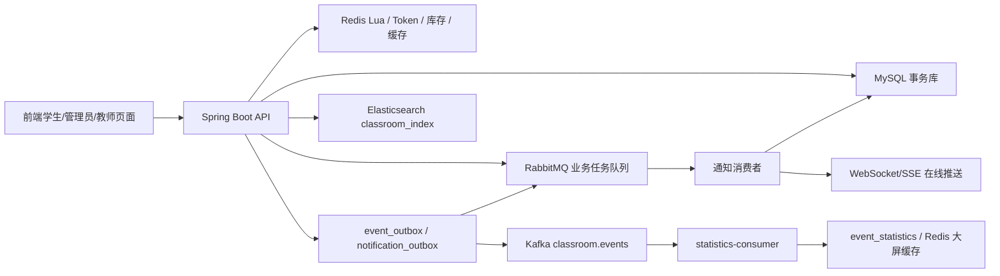
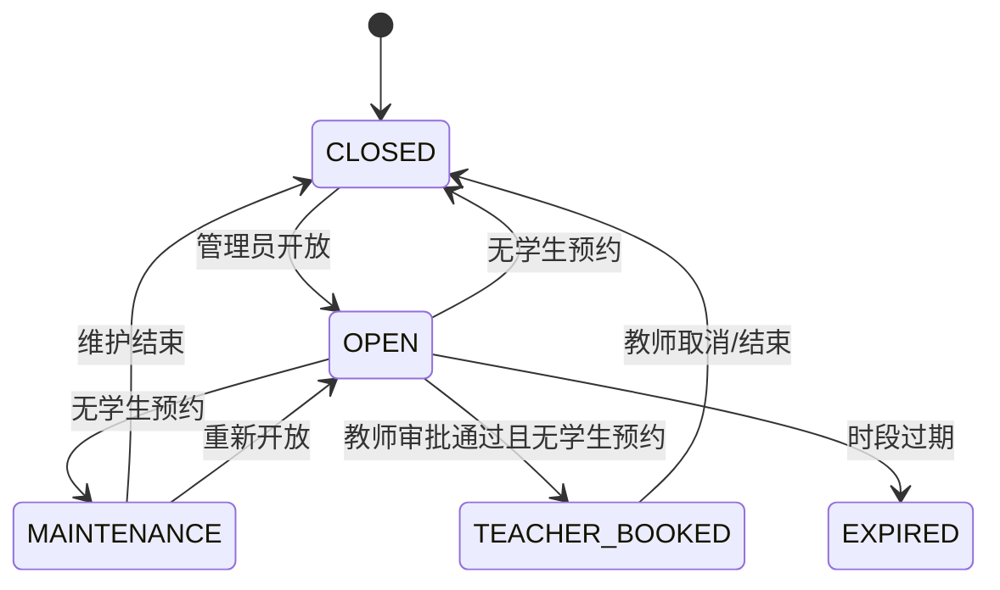
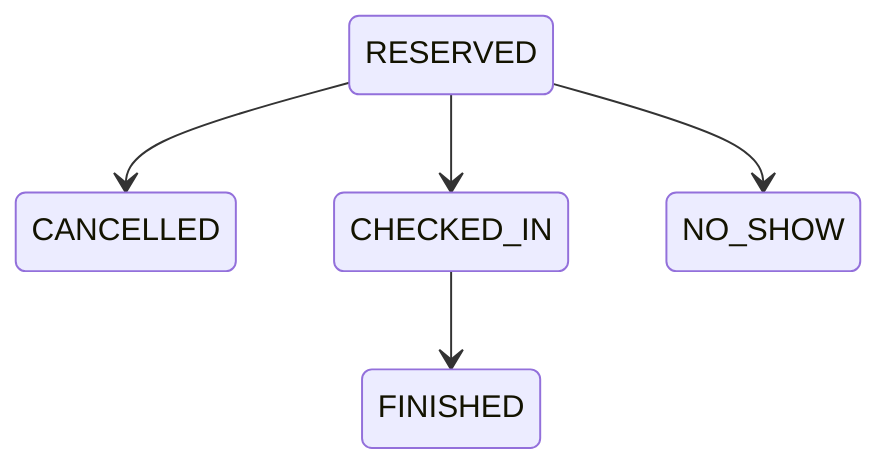
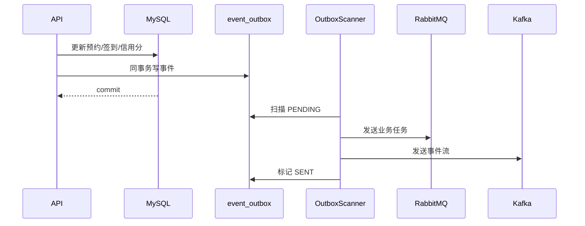
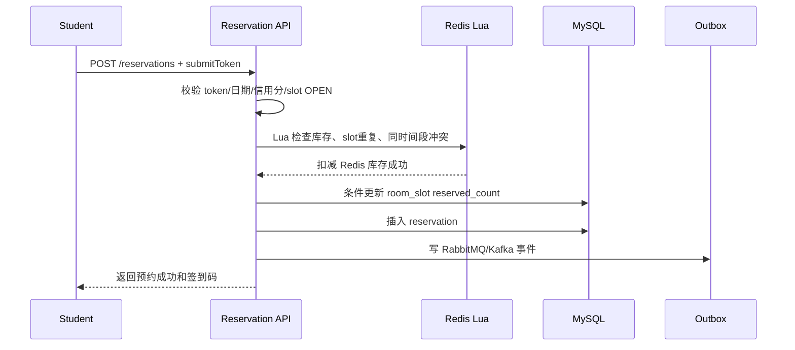

# 校园教室时段预约与智能候补调度平台重构方案

> 项目名称：基于 Spring Boot + Redis + RabbitMQ + Kafka 的校园教室时段预约与智能候补调度平台

## 0. 本次已落地的代码调整

本次先解决最核心的业务错误：学生不再被建模为“预约一整间教室”，而是预约某个 `room_slot` 下的一个名额。

| 调整 | 代码位置 | 说明 |
| --- | --- | --- |
| Redis Lua 增加 user-time 防重标记 | `src/main/java/com/xuan/boot/service/impl/ReservationServiceImpl.java:52` | 同时判断库存、同 slot 重复预约、同用户同时间段预约 |
| slot 库存按教室容量初始化 | `src/main/java/com/xuan/boot/service/impl/ReservationServiceImpl.java:316` | 新建 slot 时默认使用 `tb_classroom.capacity` |
| MySQL 扣库存同步维护 reserved_count | `src/main/java/com/xuan/boot/mapper/RoomSlotMapper.java:24` | `available_capacity - 1`，`reserved_count + 1` |
| 取消预约同步恢复 reserved_count | `src/main/java/com/xuan/boot/mapper/RoomSlotMapper.java:31` | `available_capacity + 1`，`reserved_count - 1` |
| Redis 已预约用户集合改为 room_slot 维度 | `src/main/java/com/xuan/boot/service/impl/ReservationServiceImpl.java:454` | key 从“日期+时间段”升级为“roomId+日期+时间段” |
| Redis 新增同用户同时间段标记 | `src/main/java/com/xuan/boot/support/RedisKeys.java:11` | `reserve:user-time:{userId}:{date}:{timeSlot}` |
| 数据库结构扩展迁移 | `src/main/resources/db/migration/V4__room_slot_capacity_and_event_architecture.sql` | 增加 reserved_count、waitlist_count、teacher_booking、checkin、credit、event_outbox 等表 |
| 管理员 room_slot 接口 | `src/main/java/com/xuan/boot/controller/RoomSlotController.java:24` | 创建、批量创建、开放、关闭、维护、查询开放 slot |
| 管理员 room_slot 服务 | `src/main/java/com/xuan/boot/service/impl/RoomSlotServiceImpl.java:20` | 关闭/维护/教师占用前校验是否已有学生预约 |
| 教室管理全量列表 | `src/main/java/com/xuan/boot/controller/ClassroomController.java:36` | `/rooms?includeDisabled=true` 用于管理员查看停用教室 |
| 信用分账户与流水 | `src/main/java/com/xuan/boot/service/impl/CreditServiceImpl.java:15` | 初始化 100 分、签到加分、未签到扣分、低分限制预约 |
| 未签到定时处罚 | `src/main/java/com/xuan/boot/service/impl/ReservationServiceImpl.java:322` | 超过开始后 15 分钟仍未签到则 `NO_SHOW`、扣分、释放名额、触发候补 |
| 信用分查询接口 | `src/main/java/com/xuan/boot/controller/CreditController.java:24` | `/credits/me`、`/credits/users/{userId}` |

当前代码仍兼容旧字段 `reserve_date + time_slot`。目标设计中的 `slot_date + start_time + end_time` 可以在下一次迁移中拆分；第一阶段先保持接口稳定，避免一次改太大导致项目跑不起来。

> 注意：教室本身的 `status=0` 表示教室资源停用，管理员列表仍应显示；学生可预约资源由 `room_slot.status=OPEN` 决定。不要再用“停用教室”模拟“关闭某个可预约时段”。

## 1. 第一版业务定位

第一版不做完整课程表导入，也不做自动排课。系统核心是管理员维护可预约教室时段：

1. 管理员创建 `room_slot`，即“某间教室 + 某天 + 某时间段”。
2. 管理员设置 slot 为 `OPEN` 后，学生才能预约。
3. 学生预约的是 slot 下的一个座位/名额，不是整间教室。
4. 多个学生可以预约同一个 slot，但成功数不能超过 `capacity`。
5. 同一学生同一时间段只能预约一个教室。
6. 教师临时预约是整间教室，需要管理员审批。
7. 如果 slot 已有学生预约，第一版不允许教师强制占用。
8. 如果 slot 已有学生预约，管理员第一版不能直接关闭，需要先处理已有预约。

这比课程表导入更适合作为简历第一版：业务闭环完整，技术点集中，开发复杂度可控，也符合真实学校里“管理员开放自习教室”的常见流程。

## 2. 总体架构



核心原则：

| 组件 | 职责 | 不能做什么 |
| --- | --- | --- |
| MySQL | 预约、签到、信用分、审批的最终一致性 | 不承载高并发瞬时判断的全部压力 |
| Redis Lua | 原子扣减库存、防重复预约、防重复提交 | 不作为最终账本 |
| Redisson | 用户维度、订单维度关键流程锁 | 不替代唯一索引和条件更新 |
| RabbitMQ | 通知、候补补位、信用分扣减、提醒等业务异步任务 | 不做实时统计事件流 |
| Kafka | 记录已经发生的预约/签到/取消/未签到事件，用于统计和审计 | 不判断预约是否成功，不解决超卖 |
| Elasticsearch | 教室搜索、筛选、复杂查询候选列表 | 不作为预约成功依据 |
| WebSocket/SSE | 在线实时通知 | 不保证离线消息持久化，离线依赖 notification 表 |

## 3. 核心模型：room_slot

`room_slot` 表示“某间教室 + 某一天 + 某个时间段”的资源状态。所有预约、候补、签到、教师占用、维护关闭都围绕它展开。

### 状态枚举

| 状态 | 含义 |
| --- | --- |
| `OPEN` | 开放给学生预约 |
| `CLOSED` | 管理员关闭 |
| `MAINTENANCE` | 维护中 |
| `TEACHER_BOOKED` | 教师临时预约整间教室 |
| `EXPIRED` | 已过期 |

### open_type

| 类型 | 含义 |
| --- | --- |
| `SELF_STUDY` | 自习开放 |
| `ACTIVITY` | 活动开放 |
| `TEMPORARY` | 临时开放 |

### 状态流转



## 4. 数据库设计

### 4.1 room 教室表

建议表名：`tb_room`。当前项目兼容表为 `tb_classroom`。

| 字段 | 说明 |
| --- | --- |
| `id` | 教室 ID |
| `building` / `building_name` | 教学楼 |
| `room_no` / `room_number` | 教室号 |
| `capacity` | 教室总容量，也是默认 slot 名额来源 |
| `room_type` | 普通教室、实验室、会议室等 |
| `equipment` | 简化设备字符串 |
| `status` | 启用、停用 |
| `created_at` / `create_time` | 创建时间 |
| `updated_at` / `update_time` | 更新时间 |

关键约束：`UNIQUE(building, room_no)`，当前为 `UNIQUE(building_name, room_number)`。

### 4.2 room_slot 教室时段资源表

目标字段：

| 字段 | 说明 |
| --- | --- |
| `id` | slot ID |
| `room_id` | 教室 ID |
| `slot_date` / `reserve_date` | 日期 |
| `start_time` | 开始时间 |
| `end_time` | 结束时间 |
| `time_slot` | 当前兼容字段，例如 `18:00-20:00` |
| `capacity` / `total_capacity` | 总名额 |
| `reserved_count` | 已预约名额 |
| `available_capacity` | 当前剩余名额，兼容当前代码 |
| `waitlist_count` | 候补人数 |
| `status` | `OPEN/CLOSED/MAINTENANCE/TEACHER_BOOKED/EXPIRED` |
| `open_type` | `SELF_STUDY/ACTIVITY/TEMPORARY` |
| `created_by` | 管理员 ID |
| `created_at` / `create_time` | 创建时间 |
| `updated_at` / `update_time` | 更新时间 |

关键约束：

```sql
UNIQUE(room_id, slot_date, start_time, end_time)
```

当前兼容实现：

```sql
UNIQUE(room_id, reserve_date, time_slot)
```

防超卖 SQL：

```sql
UPDATE tb_room_slot
SET reserved_count = reserved_count + 1,
    available_capacity = available_capacity - 1
WHERE id = ?
  AND status = 'OPEN'
  AND reserved_count < capacity;
```

当前项目落地在 `RoomSlotMapper.decreaseStock`，使用 `available_capacity > 0` 做条件更新。

### 4.3 reservation 学生预约表

状态：

| 状态 | 含义 |
| --- | --- |
| `RESERVED` | 已预约 |
| `CANCELLED` | 已取消 |
| `CHECKED_IN` | 已签到 |
| `NO_SHOW` | 未签到 |
| `FINISHED` | 已完成 |

状态流转：



核心字段：

| 字段 | 说明 |
| --- | --- |
| `id` | 预约单 ID |
| `user_id` | 学生 ID |
| `room_id` | 冗余教室 ID，方便列表查询 |
| `room_slot_id` | slot ID |
| `slot_date` / `reserve_date` | 日期 |
| `start_time` / `time_slot` | 时间段 |
| `end_time` | 结束时间 |
| `status` | 预约状态 |
| `sign_code` | 签到码 |
| `checkin_deadline` | 签到截止时间 |
| `cancelled_at` | 取消时间 |
| `created_at` / `create_time` | 创建时间 |

关键唯一约束：

```sql
UNIQUE(user_id, room_slot_id)
UNIQUE(user_id, slot_date, start_time, end_time)
```

第一条防止同一学生重复预约同一个 slot，第二条防止同一学生同一时间段预约多个教室。当前项目用 `active_key = userId:date:timeSlot` 兜底。

### 4.4 teacher_booking 教师临时预约表

教师预约是整间教室，必须管理员审批。

| 字段 | 说明 |
| --- | --- |
| `id` | 教师预约单 ID |
| `teacher_id` | 教师用户 ID |
| `room_id` | 教室 ID |
| `room_slot_id` | 审批通过后绑定 slot |
| `slot_date` / `reserve_date` | 日期 |
| `start_time` / `time_slot` | 时间段 |
| `end_time` | 结束时间 |
| `purpose` | 用途 |
| `status` | `PENDING/APPROVED/REJECTED/CANCELLED` |
| `approver_id` | 审批管理员 |
| `approved_at` | 审批时间 |

审批规则：

1. 如果对应 slot 不存在，审批通过时创建 `TEACHER_BOOKED` slot。
2. 如果 slot 存在且 `reserved_count > 0`，第一版拒绝审批通过。
3. 如果 slot 是 `OPEN` 但无学生预约，可以改为 `TEACHER_BOOKED`。
4. 如果 slot 是 `MAINTENANCE/CLOSED/TEACHER_BOOKED`，需要冲突提示。

### 4.5 waitlist 候补表

状态：

| 状态 | 含义 |
| --- | --- |
| `WAITING` | 等待中 |
| `PROMOTED` | 已补位，等待用户确认 |
| `CONFIRMED` | 用户确认，转正式预约 |
| `CANCELLED` | 用户取消 |
| `EXPIRED` | 超时过期 |

字段：

| 字段 | 说明 |
| --- | --- |
| `id` | 候补单 ID |
| `user_id` | 学生 ID |
| `room_slot_id` | slot ID |
| `status` | 候补状态 |
| `priority_score` | 优先级分 |
| `credit_score_snapshot` | 入队时信用分 |
| `violation_count_snapshot` | 入队时违约次数 |
| `rank_no` | 入队名次 |
| `created_at` | 入队时间 |
| `promoted_at` | 补位时间 |
| `expire_at` | 确认过期时间 |

第一版 FIFO：

```sql
ORDER BY create_time ASC
```

第二版优先级公式：

```text
priority_score = credit_score * 0.6
               + wait_minutes * 0.3
               - violation_count * 5
               - today_booking_count * 2
```

### 4.6 checkin 签到表

| 字段 | 说明 |
| --- | --- |
| `id` | 签到 ID |
| `reservation_id` | 预约单 ID |
| `user_id` | 学生 ID |
| `room_slot_id` | slot ID |
| `checkin_type` | `CODE/QR/GEO` |
| `checkin_time` | 签到时间 |
| `client_ip` | 客户端 IP |
| `device_info` | 设备信息 |

关键约束：`UNIQUE(reservation_id)`，防止重复签到。

### 4.7 credit_account / credit_record 信用分

`credit_account`：

| 字段 | 说明 |
| --- | --- |
| `user_id` | 用户 ID |
| `credit_score` | 当前信用分，默认 100 |
| `violation_count` | 违约次数 |
| `last_change_time` | 最近变更时间 |

`credit_record`：

| 字段 | 说明 |
| --- | --- |
| `id` | 记录 ID |
| `user_id` | 用户 ID |
| `reservation_id` | 关联预约 |
| `change_score` | 本次变化 |
| `before_score` | 变更前 |
| `after_score` | 变更后 |
| `reason` | 原因 |
| `remark` | 备注 |

规则建议：

| 行为 | 分值 |
| --- | --- |
| 正常签到并完成 | `+1` |
| 提前取消，不影响他人 | `0` 或 `+0` |
| 未签到 | `-5` |
| 候补补位后超时不确认 | `-2` |
| 恶意重复提交/频繁取消 | `-1 ~ -3` |

信用分影响：

1. 低于 80：热门教室候补优先级降低。
2. 低于 60：限制每天预约次数。
3. 低于 40：限制预约热门时段，需要恢复信用。

### 4.8 notification 通知表

| 字段 | 说明 |
| --- | --- |
| `id` | 通知 ID |
| `user_id` | 接收用户 |
| `notification_type` | `RESERVE/WAITLIST/CHECKIN/CREDIT/FEEDBACK` |
| `title` | 标题 |
| `content` | 内容 |
| `business_id` | 关联业务 ID |
| `read_status` | 是否已读 |
| `read_time` | 已读时间 |
| `created_at` | 创建时间 |

### 4.9 event_outbox 事件发送表

用于保证本地事务和消息发送一致性。

| 字段 | 说明 |
| --- | --- |
| `id` | 主键 |
| `event_id` | 全局事件 ID |
| `event_type` | 事件类型 |
| `target_type` | `RABBIT/KAFKA/BOTH` |
| `aggregate_type` | 聚合类型，如 `RESERVATION` |
| `aggregate_id` | 聚合 ID |
| `user_id` | 用户 |
| `room_id` | 教室 |
| `room_slot_id` | slot |
| `payload` | JSON 消息体 |
| `status` | `PENDING/SENT/RETRY/DEAD` |
| `retry_count` | 重试次数 |
| `next_retry_time` | 下次重试 |
| `last_error` | 最近错误 |

流程：



### 4.10 event_statistics 统计结果表

可以存：

1. 每个 slot 预约人数、签到人数、未签到人数、候补人数。
2. 每个教室使用率、签到率、爽约率。
3. 热门教室排行榜。
4. 楼栋使用率。
5. 每日预约趋势。
6. 候补成功率、平均等待时间。

### 4.11 room_equipment / room_tag

用于 Elasticsearch 搜索：

| 表 | 用途 |
| --- | --- |
| `room_equipment` | 投影仪、空调、白板、插座等 |
| `room_tag` | 自习、考试、讲座、实验、安静区等 |

## 5. 学生预约和教师预约的区别

学生预约：

1. 只能预约 `OPEN` slot。
2. 每人占用一个名额。
3. 多个学生共享同一个 slot 的容量。
4. 成功后必须签到。
5. 未签到扣信用分。
6. 满员可进入候补。

教师预约：

1. 预约整间教室。
2. 必须管理员审批。
3. 审批通过后 slot 变成 `TEACHER_BOOKED`。
4. 如果已有学生预约，第一版拒绝教师强制占用。

面试说法：

> 学生自习的真实需求是座位/名额，教师上课、考试、活动才是整间教室。把两类需求都抽象到 `room_slot` 上，学生消耗 slot 的一个库存，教师审批通过后占用整个 slot，这样既符合业务，也能自然引出库存、并发、签到、候补和信用分。

## 6. 管理员开放 room_slot 机制

接口建议：

| 接口 | 说明 |
| --- | --- |
| `POST /api/admin/room-slots` | 手动创建 slot |
| `POST /api/admin/room-slots/batch` | 批量创建 slot |
| `PUT /api/admin/room-slots/{id}/open` | 开放 |
| `PUT /api/admin/room-slots/{id}/close` | 关闭，要求无预约 |
| `PUT /api/admin/room-slots/{id}/maintenance` | 维护，要求无预约 |
| `GET /api/admin/room-slots` | 管理员查询全部 |
| `GET /api/student/room-slots/open` | 学生查询可预约 slot |

批量创建参数：

```json
{
  "roomIds": [1, 2, 3],
  "dateStart": "2026-06-01",
  "dateEnd": "2026-06-07",
  "timeSlots": ["08:00-10:00", "10:00-12:00"],
  "capacity": 80,
  "openType": "SELF_STUDY",
  "status": "OPEN"
}
```

为什么第一版管理员维护更合理：

1. 不依赖学校课程系统接口。
2. 不需要处理复杂调课、单双周、节假日、临时停课。
3. 管理员最清楚哪些教室能开放自习。
4. 仍然是真实业务，不是为了简化而脱离场景。
5. 后续可在 `room_slot` 基础上接入课程表，不需要推倒重来。

## 7. 预约主链路



关键点：

1. Submit Token 防止前端重复点击。
2. Redis Lua 原子判断和扣减。
3. Redisson 用户锁减少同用户并发冲突。
4. MySQL 条件更新兜底防超卖。
5. 唯一索引兜底防重复预约。
6. RabbitMQ 和 Kafka 都通过 Outbox 异步投递。

Redis Lua 负责：

1. `stock:room_slot:{slotId}` 或当前兼容 `reserve:stock:{roomId}:{date}:{timeSlot}` 是否大于 0。
2. `reserved_users:room_slot:{slotId}` 或当前兼容 `reserve:users:{roomId}:{date}:{timeSlot}` 是否包含用户。
3. `reserved:user_time:{userId}:{date}:{startTime}:{endTime}` 是否存在。
4. 成功后扣库存、写用户集合、写 user-time 标记。

MySQL 兜底 SQL：

```sql
UPDATE room_slot
SET reserved_count = reserved_count + 1
WHERE id = ?
  AND status = 'OPEN'
  AND reserved_count < capacity;
```

## 8. 候补补位

流程：

1. slot 满员后，如果用户选择候补，写入 waitlist。
2. 第一版 FIFO，按 `created_at ASC`。
3. 有人取消或未签到释放名额后，触发候补补位。
4. 补位成功后发送 RabbitMQ 通知。
5. 写 Kafka `WAITLIST_PROMOTED` 事件。
6. 用户需要在 `expire_at` 前确认。
7. 超时则 `EXPIRED`，继续补给下一个人。

候补面试说法：

> 第一版先用 FIFO 保证业务可落地；第二版引入信用分、等待时间、违约次数和当天预约次数计算 `priority_score`。补位本身仍然走 Redis Lua + MySQL 条件更新，不能只靠 MQ 消息，因为 MQ 只能触发任务，不能保证库存一致性。

## 9. 签到和未签到

签到窗口：开始前 15 分钟到开始后 15 分钟。

签到流程：

1. 输入签到码或扫码。
2. 校验预约存在且属于当前用户。
3. 校验 `reservation.status = RESERVED`。
4. 校验当前时间在签到窗口。
5. 事务更新为 `CHECKED_IN`。
6. 插入 `checkin`。
7. 可选加信用分。
8. 写 `event_outbox`。
9. RabbitMQ 发送签到通知。
10. Kafka 发送 `CHECKIN_SUCCESS`。
11. WebSocket/SSE 推送前端。

未签到流程：

1. 定时任务扫描超过签到窗口仍是 `RESERVED` 的预约。
2. 更新为 `NO_SHOW`。
3. 写信用分扣减记录。
4. 释放名额或触发候补补位。
5. RabbitMQ 发送违约通知。
6. Kafka 发送 `NO_SHOW`。
7. WebSocket/SSE 推送信用分变化。

## 10. Redis Key 设计

| Key | 作用 | TTL 建议 | 一致性处理 |
| --- | --- | --- | --- |
| `stock:room_slot:{slotId}` | slot 剩余名额 | slot 结束后 1 天 | MySQL 为准，失败回滚或定时校准 |
| `reserved_users:room_slot:{slotId}` | 判断用户是否已预约该 slot | slot 结束后 1 天 | 取消预约时删除成员 |
| `reserved:user_time:{userId}:{date}:{start}:{end}` | 防同一学生同一时间段预约多个教室 | slot 结束后 1 天 | 取消预约时删除 |
| `submit_token:{userId}:{token}` | 防重复提交 | 5 分钟 | 预约时先删除，删除失败拒绝 |
| `waitlist:room_slot:{slotId}` | 候补队列 | slot 结束后 1 天 | DB waitlist 为准 |
| `slot:status:{slotId}` | 缓存 slot 状态 | 5 到 30 分钟 | MySQL 最终校验 |

当前兼容 key：

1. `reserve:stock:{roomId}:{date}:{timeSlot}`
2. `reserve:users:{roomId}:{date}:{timeSlot}`
3. `reserve:user-time:{userId}:{date}:{timeSlot}`

## 11. RabbitMQ 职责

RabbitMQ 是业务任务队列，适合：

1. 预约成功通知。
2. 预约取消通知。
3. 候补补位通知。
4. 候补确认提醒。
5. 预约开始前提醒。
6. 未签到违约通知。
7. 信用分扣减通知。
8. 管理员审批通知。
9. 反馈工单通知。

面试说法：

> RabbitMQ 更适合明确的业务动作，比如通知、提醒、补位任务。它强调 ACK、重试、死信队列和任务可靠投递。统计分析不是 RabbitMQ 的强项，所以我把事件流交给 Kafka。

## 12. Kafka 合理加入方式

Kafka 不用于：

1. 判断预约是否成功。
2. 判断签到是否成功。
3. 解决超卖。
4. 替代 Redis Lua。
5. 替代 MySQL 事务。
6. 替代 RabbitMQ 通知。

Kafka 只记录已经发生的事件。

Topic 第一版：

```text
classroom.events
```

事件类型：

| eventType | 说明 |
| --- | --- |
| `RESERVATION_SUCCESS` | 预约成功 |
| `RESERVATION_CANCELLED` | 预约取消 |
| `CHECKIN_SUCCESS` | 签到成功 |
| `NO_SHOW` | 未签到 |
| `WAITLIST_JOINED` | 加入候补 |
| `WAITLIST_PROMOTED` | 候补补位 |
| `WAITLIST_CONFIRMED` | 候补确认 |
| `ROOM_VIEW` | 浏览教室 |
| `ROOM_SEARCH` | 搜索教室 |
| `TEACHER_BOOKING_APPROVED` | 教师预约审批通过 |
| `ROOM_SLOT_OPENED` | 管理员开放时段 |
| `ROOM_SLOT_CLOSED` | 管理员关闭时段 |
| `CREDIT_CHANGED` | 信用分变动 |

消息体：

```json
{
  "eventId": "uuid",
  "eventType": "CHECKIN_SUCCESS",
  "userId": 1001,
  "roomId": 101,
  "slotId": 20260520001,
  "reservationId": 3001,
  "building": "A",
  "roomNo": "A101",
  "slotDate": "2026-05-20",
  "startTime": "19:00",
  "endTime": "21:00",
  "eventTime": "2026-05-20 18:55:20"
}
```

## 13. Kafka 消费者：statistics-consumer

第一版只做一个消费者即可：`statistics-consumer`。

消费 `classroom.events`，统计：

1. 每个 slot 预约人数。
2. 每个 slot 签到人数。
3. 每个 slot 未签到人数。
4. 每个 slot 候补人数。
5. 每个教室使用率。
6. 每个教室签到率。
7. 每个教室爽约率。
8. 热门教室排行榜。
9. 楼栋使用率。
10. 每日预约趋势。
11. 候补成功率。
12. 平均候补等待时间。

结果写入：

1. `event_statistics` 表，适合持久化。
2. Redis，适合管理员大屏秒级读取。

## 14. WebSocket / SSE 实时通知

适用场景：

1. 候补补位成功。
2. 管理员回复反馈工单。
3. 教师预约审批结果变化。
4. 预约开始前提醒。
5. 信用分变动。
6. 管理员大屏实时数字变化。

推荐第一版用 SSE，因为它比 WebSocket 简单，服务端单向推送正好满足通知场景。

接口建议：

| 接口 | 说明 |
| --- | --- |
| `GET /api/notifications/stream` | SSE 订阅 |
| `GET /api/notifications/unread-count` | 未读数量 |
| `PUT /api/notifications/{id}/read` | 标记已读 |

关系：

1. RabbitMQ 负责后端异步业务消息投递。
2. 消费者消费 RabbitMQ 后写 `notification` 表。
3. 如果用户在线，通过 SSE 推送。
4. 如果用户不在线，通知仍在 MySQL，登录后可查。

## 15. Elasticsearch 搜索模块

ES 只做搜索，不做预约成功依据。

适合搜索：

1. 教学楼。
2. 教室编号。
3. 容量范围。
4. 设备：投影仪、空调、白板、插座。
5. 用途：自习、考试、讲座、实验。
6. 开放状态。
7. 时间段可用教室候选。

索引：`classroom_index`

```json
{
  "roomId": 101,
  "building": "A",
  "roomNo": "A101",
  "capacity": 80,
  "roomType": "NORMAL",
  "equipmentList": ["projector", "air_conditioner"],
  "tags": ["self_study", "quiet"],
  "purpose": ["SELF_STUDY", "EXAM"],
  "status": "AVAILABLE",
  "availableSlots": [
    {
      "slotId": 20260520001,
      "slotDate": "2026-05-20",
      "startTime": "19:00",
      "endTime": "21:00",
      "remaining": 12
    }
  ],
  "updatedAt": "2026-05-17 12:00:00"
}
```

接口：

```text
GET /api/rooms/search?keyword=&building=&minCapacity=&equipment=&date=&timeSlot=
```

面试说法：

> ES 返回的是候选教室列表，真正预约时仍然回到 MySQL + Redis 校验。因为 ES 可能有同步延迟，不能承担库存一致性。

## 16. 压测方案

重点压测接口：

1. 热门 slot 高并发预约。
2. Submit Token 防重复提交。
3. Redis Lua 扣库存。
4. MySQL 条件更新防超卖。
5. 候补补位。
6. 签到接口。
7. 查询可预约教室接口。
8. SSE 通知推送，可选。

指标：

1. QPS。
2. 平均响应时间。
3. P95。
4. P99。
5. 错误率。
6. 吞吐量。
7. MySQL CPU / 连接数。
8. Redis QPS / 内存。
9. RabbitMQ 消息堆积。
10. Kafka 消费延迟。
11. 是否超卖。
12. 是否重复预约。
13. 是否重复签到。

无超卖验证：

1. 设置某个 `room_slot.capacity = 80`。
2. JMeter 模拟 1000 个用户并发预约同一 slot。
3. 最终 `reservation` 成功数必须 `<= 80`。
4. `room_slot.reserved_count` 必须等于成功预约数。
5. `available_capacity + reserved_count = capacity`。
6. Redis stock 和 MySQL 最终一致。
7. 同一用户不能出现多条成功预约。
8. 同一用户同一时间段不能预约多个教室。
9. 失败用户进入候补或返回名额不足。

压测报告模板：

| 项 | 内容 |
| --- | --- |
| 测试环境 | CPU、内存、JDK、MySQL、Redis、RabbitMQ、Kafka |
| 并发用户数 | 例如 1000 |
| 测试接口 | `/reservations` |
| 数据规模 | slot 容量 80、用户 1000 |
| QPS | 实测填写 |
| P95 | 实测填写 |
| P99 | 实测填写 |
| 错误率 | 实测填写 |
| 成功预约数 | 必须 <= 80 |
| 候补人数 | 约等于 920 |
| 是否超卖 | 否 |
| 是否重复预约 | 否 |
| 优化前后对比 | 直连 DB vs Redis Lua + MySQL 条件更新 |

简历压测亮点：

> 针对热门自习教室抢座场景，使用 Submit Token 防重复提交，Redis Lua 原子完成库存判断、名额扣减和用户预约标记，MySQL 条件更新与唯一索引做最终一致性兜底；在 JMeter 1000 用户并发预约容量 80 的 room_slot 场景下，成功预约数稳定不超过 80，`reserved_count + available_capacity = capacity`，无超卖、无重复预约，失败请求进入候补队列，显著降低数据库瞬时写入压力。

## 17. 简历内容

### 项目描述

基于 Spring Boot + MyBatis + MySQL 构建校园教室时段预约与智能候补调度平台，以 `room_slot` 统一抽象教室、日期、时间段和名额库存；学生预约开放时段下的座位名额，教师临时预约整间教室并由管理员审批。系统使用 Redis Lua + Redisson + MySQL 条件更新解决热门教室高并发抢座下的超卖和重复预约问题，通过 RabbitMQ + Outbox 实现通知、候补补位、信用分变更等异步任务可靠投递，并规划 Kafka 事件流统计、Elasticsearch 教室搜索和 SSE 实时通知，支撑管理员大屏、教室使用率分析和审计分析。

### 项目亮点

1. 以 `room_slot` 作为核心资源模型，将“教室 + 日期 + 时间段 + 容量 + 状态”统一建模，支持学生名额预约、教师整间教室审批、维护关闭和过期处理。
2. 将学生预约从“占用整间教室”重构为“占用一个 slot 名额”，多个学生可预约同一教室同一时间段，更符合自习室真实业务。
3. 热门 slot 抢座链路使用 Submit Token + Redis Lua + Redisson + MySQL 条件更新 + 唯一索引，多层防止重复提交、重复预约和库存超卖。
4. 候补队列第一版采用 FIFO 自动补位，后续可扩展信用分、等待时间、违约次数的综合优先级模型。
5. 设计签到和信用分体系，未签到由定时任务标记 `NO_SHOW` 并扣分，信用分影响预约资格和候补排序。
6. 使用 RabbitMQ + Outbox 处理预约通知、候补补位、信用分变动、反馈工单等业务异步任务，支持失败重试和死信兜底。
7. 规划 Kafka `classroom.events` 事件流，记录预约、取消、签到、未签到、候补等已发生事件，用于实时统计和管理员大屏。
8. 规划 Elasticsearch `classroom_index`，支持按楼栋、容量、设备、标签、开放时段进行复杂搜索，但预约成功仍回到 MySQL + Redis 校验。
9. 规划 SSE 实时通知，RabbitMQ 消费者写通知表后向在线用户推送，离线用户下次登录可查看未读消息。
10. 设计 JMeter 压测和一致性校验方法，通过成功数、库存数、唯一索引和 Redis/MySQL 对账证明无超卖、无重复预约。

## 18. 高频面试解释

### 为什么学生不是预约整间教室？

学生自习通常只占用一个座位，整间教室是共享空间。如果一个学生预约就锁死整间教室，业务上不合理，也没有库存、候补、签到率这些真实场景。改成预约 `room_slot` 下的名额后，一个教室可以有多个学生预约，容量就是库存，候补和信用分也有了真实意义。

### 为什么第一版不做课程表导入？

课程表导入涉及教务系统接口、单双周、调课、节假日、临时停课等复杂问题，第一版容易失控。管理员维护开放时段更简单，也符合学校实际管理方式：管理员根据课程安排和维护情况开放自习时段。这样项目能先落地闭环，后续再平滑扩展课程表。

### 后续怎么扩展课程表导入？

二期增加 `course_schedule` 表。导入课程后，可以生成 `COURSE_OCCUPIED` 类型的 room_slot，或者阻止管理员开放冲突时段。如果课程变更影响已有预约，交给管理员冲突处理。因为第一版核心已经是 `room_slot`，所以课程表只是在 slot 之上增加占用来源，不需要推倒重做。

### 为什么核心表是 room_slot？

因为系统真正调度的不是“教室静态信息”，而是“某教室某天某时间段的可用资源”。管理员开放、学生预约、教师占用、候补、签到、维护、过期都发生在这个粒度上。`room_slot` 能统一承载这些状态。

### 为什么 RabbitMQ 和 Kafka 都用？

RabbitMQ 处理业务任务，比如通知、候补补位、提醒、信用分变动，强调可靠投递和业务消费。Kafka 记录已经发生的事实事件，比如预约成功、签到成功、未签到，用于统计、审计和大屏。两者职责不同，不互相替代。

### 为什么 Kafka 不解决超卖？

超卖判断必须同步、强一致，发生在用户请求返回之前。Kafka 是异步日志流，消费有延迟，不能决定预约是否成功。预约成功必须由 Redis Lua、MySQL 条件更新和唯一索引保证；Kafka 只能记录成功后的事件。

### 预约、签到、未签到如何支撑大屏？

预约成功写 `RESERVATION_SUCCESS`，签到写 `CHECKIN_SUCCESS`，未签到写 `NO_SHOW`。Kafka 消费者聚合这些事件，得到每个教室的预约人数、签到人数、爽约率、使用率、热门排行，再写入 Redis 或 `event_statistics` 给管理员大屏读取。

### ES 为什么只做搜索？

ES 有同步延迟，不能做库存判断。它适合按楼栋、设备、容量、标签和关键词搜索候选教室。用户点预约时，后端仍然查 MySQL slot 状态并走 Redis Lua 扣库存。

### WebSocket/SSE 和 RabbitMQ 什么关系？

RabbitMQ 是后端任务队列，保证通知任务可靠消费；SSE/WebSocket 是前端在线推送通道。消费者消费 RabbitMQ 后写 `notification` 表，如果用户在线就通过 SSE 推送，不在线则保留未读消息。

### 压测怎么证明无超卖？

设置 slot 容量 80，用 1000 用户并发预约。压测结束后查三件事：成功预约数 `<= 80`，`room_slot.reserved_count + available_capacity = capacity`，同一用户没有重复成功预约。如果 Redis stock 和 MySQL 库存一致，并且唯一索引没有冲突数据，就能证明无超卖、无重复预约。

## 19. 实现优先级

1. `room_slot` 核心模型。
2. 学生预约名额。
3. Redis Lua + MySQL 条件更新防超卖。
4. 候补补位。
5. 签到 + 信用分。
6. RabbitMQ 通知。
7. Kafka 事件流统计。
8. WebSocket / SSE 实时通知。
9. Elasticsearch 搜索。
10. JMeter 压测报告。

当前项目已经完成 1 到 6 的主要骨架，并把 1 到 5 的业务语义修正为“slot 名额模型 + 信用分处罚闭环”。Kafka、SSE、Elasticsearch 仍建议作为下一阶段逐步实现，避免为了堆技术破坏预约主链路的一致性。
